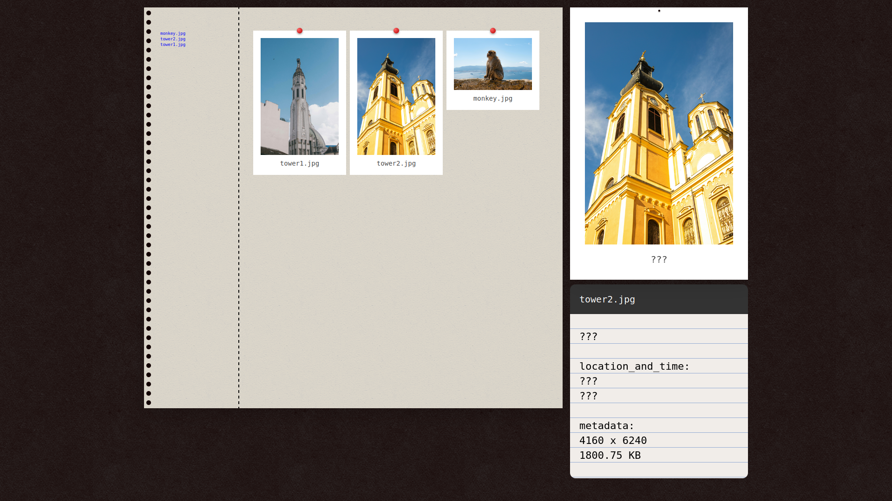

# 📷 Personal Gallery

A simple and clean photo gallery project built with **HTML**, **CSS**, **JavaScript**, **Python**, and **JSON**.

## 📸 Demo / Preview

## 🚀 Features

- Beautiful grid-based photo gallery using your own images
- Auto-generated descriptions extracted from image file metadata
- Lightweight, fast, and easy to use — no backend or database needed

## 💡 How to Use

1. Clone the repository and add your image files to the `photos/` folder  
2. Run the `generate_photo_list.py` script to generate the JSON data  
3. Open `gallery.html` in a live server or directly in your browser

## ⚙️ How It Works

- The Python script reads each image file and generates a `photo_filenames_list.json` with metadata like dimensions, file size, and timestamps
- JavaScript reads this JSON and dynamically injects each image and its data into the HTML grid
- All images are displayed in a responsive gallery layout

